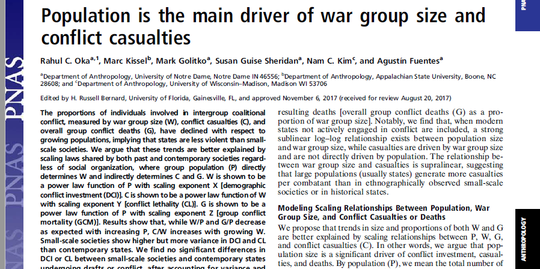

```{r setup, include=FALSE}
options(htmltools.dir.version = FALSE)

#packages i may need
library(tidyverse)
library(plotly)
library(leaflet)
library(knitr)
library(DT)
library(xtable)
library(kableExtra)
library(ggridges)
library(knitr)
```

```{r xaringan-themer, include=FALSE, warning=FALSE}
library(xaringanthemer)
# style_mono_accent(
#   base_color = "#1c5253",
#   header_font_google = google_font("Josefin Sans"),
#   text_font_google   = google_font("Montserrat", "300", "300i"),
#   code_font_google   = google_font("Fira Mono")
# )

extra_css <- list(
  ".small" = list("font-size" = "90%"),
  ".full-width" = list(
    display = "flex",
    width   = "100%",
    flex    = "1 1 auto"
  )
)
```

background-image: url(Liverpool_images/background2.png
background-size: contain


---
#content warning

---

.content-box-red[
## When did *symbolic thought* evolve?]
.content-box-red[
## What was the role of  collective violence in human origins? ]

.content-box-red[
## How popular science/culture present these data?]


---

background-image: url(Liverpool_images/Picture3.png)
background-size: contain


???

## Often oversimplify human behavior & misunderstand evolutionary theory 
##Assume reductionist models of genotype-phenotype interaction 
##The West is best  
##Assume that males are driving much of the evolutionary story

---

background-image: url(Liverpool_images/quote_1b.png)
background-size: contain

---

background-image: url(Liverpool_images/quote_2.png)
background-size: contain


---
background-image: url(Liverpool_images/quote_4.png)
background-size: contain


---
background-image: url(Liverpool_images/quote_5.png)
background-size: contain

---

background-image: url(Liverpool_images/quote_6.png)
background-size: contain


---
background-color: #f1d7a2
https://imagecolorpicker.com/en

# so, what *was* life like for our early ancestors?


---
class: center, inverse

#Warfare in our evolutionary past
____________________________________

---
class: center, inverse

#Warfare in our evolutionary past
____________________________________


.pull-left[

##Some argue war is very old


]
--
.pull-right[

##others think it is a product of *civilization* 

]

???

Organized aggression and violence between socially distinct or autonomous groups of people This paper


---
```{r, echo=FALSE, message=FALSE, warning=FALSE}
library(DT)
def <- read_csv("def3.csv")
DT::datatable(def,
              fillContainer = FALSE, options = list(pageLength = 3))
```


---
class: inverse, center, middle 

#When did human warfare evolve?


---


class: inverse
background-image: url(images/Types2.png)
background-size: contain
background-position: center bottom

.center[
#Types of data
]

---


class: inverse
background-image: url(images/Types3.png)
background-size: contain


---
Early evidence of interpersonal violence


```{r, echo=FALSE, message=FALSE, warning=FALSE}
library(leaflet)
my_data <- read_csv("siteListCSV_updated2.csv")
my_data <- my_data %>% janitor::clean_names() %>% 
  mutate(age_range = as_factor(age_range)) %>% filter(sitename != "Sima de los Huesos")
pal <- colorFactor(palette = "Reds", domain = my_data$age_range)
pal2 <- colorFactor(topo.colors(5), domain = my_data$age_range)


leaflet(data = my_data) %>% addTiles() %>%
  addCircleMarkers(~longitude , ~latitude, color = ~pal2(age_range),
                   popup = ~paste("Name: ", sitename, "<br>",
                                  "age of Site: ", age,
                                  ""), label = ~as.character(sitename))

```


???

List

## Stw 53 maxilla from Member 5 of Sterkfontein, South Africa
## Bodo skull
## Jebel Sahaba 
## Nataruk
## Gran Dolina

### file drawer problem 

???

interpersonal violence
was in the past. There are many factors at work. For one, we would
imagine studies showing evidence of warfare are more likely to be published
than ones that do not, leading to a “file drawer” problem. Secondly,
the interpretation of bioarcheological indicators of violence is far
from straightforward. Earlier claims of warfare based on taphonomic
markers may need to be reassessed with modern techniques that are
better able to distinguish anthropogenic and natural modifications.

One of the oldest examples of possible interpersonal violence is
the Stw 53 maxilla from Member 5 of Sterkfontein, South Africa
(Pickering et al., 2000). The Bodo cranium also shows cut marks
(White, 1986). Indeed, many examples of cannibalism have been identified
in the Pleistocene, though the exact purpose of this behavior is
unclear (Kim & Kissel, 2018). Cannibalism is not uncommon in the animal
world so we should not be too surprised to see it documented in
these populations and it is possible individuals who had died of natural
causes were eaten because of resource stress. Nonhuman populations
are believed to regulate their population through the killing of the
young, a behavior seen in brown bears (Young & Ruff, 1982). A similar
behavior may occur in polar bears (Taylor, Larsen, & Schweinsburg,
1985). More generally, cannibalism occurs in animals during times of
resource stress or population pressure (Polis, Myers, & Hess, 1984).
The fact that such behaviors occur in nonhuman animals suggests that
it is difficult to interpret the occurrence of particular forms of cannibalism
from the current taphonomic data alone. But were these cases the
result of violent actions? And if so, were they part of group-on-group,
coalitional violence? Interpersonal violence is not the same as warfare
and we cannot use these cases to support the assertion that warfare is
ancient. We have no information about these acts being related to any
sort of systematic exocannibalism, thus precluding anything more than
speculation about collective violence, much less warfare.


---


background-image: url(Liverpool_images/Picture4.png)
background-size: contain
---


background-image: url(Liverpool_images/Picture5.png)
background-size: contain


---


class: inverse, center

# Recent debate on war group numbers

.pull-left[

]


.pull-right[

]


???
scholars have noted that in hunter-gather populations, the number of people involved in fighting ~40% of the population, but this drops in state-level societies. 

"re people in big, modern societies more or less violent than our forebears? The answer is neither, according to a controversial new study: People who lived in small bands in the past had no more proclivity toward violence than we do today. The finding—based on estimates of war casualties throughout history—undercuts the popular argument that humans have become a more peaceful species over time, thanks to advances in technology and governance. But some critics aren’t convinced.

That includes the man who most recently popularized the idea, psychologist Steven Pinker of Harvard University, who calls the new findings “a statistical gimmick.” He argues in his 2011 book The Better Angels of Our Nature: Why Violence Has Declined that the emergence of institutions like nation-states with strong central governments, trade networks, and wide-ranging communication increased interdependence and reduced deaths due to violence. He cited data suggesting that fewer people die in wars today, relative to a society’s total population, than among small tribes of hunter-gatherers, pastoralists, and horticulturalists—how human society organized for most of its history.

But a team led by anthropologist Rahul Oka at the University of Notre Dame in Indiana wondered whether there was a mathematical explanation for why fewer people proportionally are lost to violence nowadays. They reasoned that as populations get bigger, their armies don’t necessarily grow at the same rate. In a small group of 100 adults, for example, it would be perfectly reasonable to have 25 warriors, says anthropologist and study co-author Mark Golitko, also at Notre Dame. But in a population of 100 million, supporting and coordinating an army of 25 million soldiers is logistically impossible, to say nothing of such an army’s effectiveness. Researchers call that incongruity a scaling effect."


---
class: inverse

## But is it that simple?

--

##Maybe the drop is due to broader issues that appear as population size increases

--



???
33 mins

To test this collected data on population & war group size for ~300 societies and data from specific historical conflicts


is this drop in the number of people involved in war (what we call the “war group”) due to the effects of living in a state or is it a reflection of broader issues that appear when population increases?
We collected data on population and war group size from 295 societies and on war group size and conflict-related casualties from 430 historical conflicts going back to 2500 B.C. We show that, as population goes up, the proportion of people involved in conflict decreases.  In other words, it is not that states prevent violence, but rather that other factors, such as the need to feed, cloth, and arm a war group makes it harder to involve a large percentage of people in more complex societies. 


---


### Is drop in  number of people involved in war due to  effects of living in a state or is it a reflection of broader issues related to population?

### Collected data on population & war group size for ~300 societies and data from specific historical conflicts


### As population goes up, the proportion of people involved in conflict decreases. But it is not that states prevent violence, but rather that other factors make it harder to involve large percentage of people in more complex societies.


### The relationship between population size &  wargroup size is based on the ratio of the wargroup/population
---

```{r read in data, echo=FALSE, message=FALSE, warning=FALSE}
war <- read_csv("PopSizeTemp.csv") ##### or temp file?
DCI <- read_csv("X_Factor_Dataset.csv")
DCI_interact <-  DCI %>% gather(value = X, key = country, Belgium:Iraq)
DCI_summary <- DCI_interact %>% group_by(country) %>% summarise(DCI_mean = mean(X, na.rm = TRUE), DCI_sd = sd(X, na.rm = TRUE))
```

```{r figure, echo=FALSE, message=FALSE, warning=FALSE}

plot_Fig1a2 <- ggplot() + 
  geom_point(data = war, aes(x= Population, y = Overall_War_Group_Size_W, color = Time_Type, text = paste("Society: ", Society) ))+ 
  geom_smooth(data = war, aes(x= Population, y = Overall_War_Group_Size_W, group=1),method="lm") +
  theme(legend.position='none') + labs(y = "overall war group size", x = "population size", caption = " war group size =  number of individuals involved in conflict-related activities") + 
  scale_x_log10(label = scales::comma) + scale_y_log10(label = scales::comma)


plot_Fig1a3 <- ggplot() + 
  geom_point(data= war, aes(x= Population, y = W.P, color = Time_Type, text = paste("Society: ", Society))) + 
  geom_smooth(data = war, aes(x= Population, y = W.P, group=1),method="lm") +
  theme(legend.position='none') + labs(y = "Proportion of society involved in coalitional violence", x = "population size") + 
  scale_x_log10(label = scales::comma) + scale_y_log10(label = scales::comma)


```


```{r echo=FALSE, message=FALSE, warning=FALSE}
ggplotly(plot_Fig1a2, height = 500, width = 850)
```


---

```{r echo=FALSE, message=FALSE, warning=FALSE}
ggplotly(plot_Fig1a3, height = 500, width = 850)
```

##The relationship between population size & wargroup size is based on the ratio of the wargroup/population

???
fix

```{r datatable for war and read in data, echo=FALSE, message=FALSE, warning=FALSE}
war <- read_csv("PopSizeTemp.csv") ##### or temp file?
DCI <- read_csv("X_Factor_Dataset.csv")
DCI_interact <-  DCI %>% gather(value = X, key = country, Belgium:Iraq)
DCI_summary <- DCI_interact %>% group_by(country) %>% summarise(DCI_mean = mean(X, na.rm = TRUE), DCI_sd = sd(X, na.rm = TRUE))
```

```{r code for figure 1a1, echo=FALSE, message=FALSE, warning=FALSE}
#plot_Fig1a1 <- ggplot() + geom_point(data = war, aes(x= log(Population), y = log(Overall_War_Group_Size_W), color = Time_Type))+ geom_smooth(data = war, aes(x= log(Population), y = log(Overall_War_Group_Size_W), group=1),method="lm") + geom_point(data= war, aes(x= log(Population), y = log(W.P), color = Time_Type)) + geom_smooth(data = war, aes(x= log(Population), y = log(W.P), group=1),method="lm")


plot_Fig1a1 <- ggplot() + geom_point(data = war, aes(x= log(Population), y = log(Overall_War_Group_Size_W), color = Time_Type, text = paste("Society: ", Society) ))+ geom_smooth(data = war, aes(x= log(Population), y = log(Overall_War_Group_Size_W), group=1),method="lm") + geom_point(data= war, aes(x= log(Population), y = log(W.P), color = Time_Type, text = paste("Society: ", Society))) + geom_smooth(data = war, aes(x= log(Population), y = log(W.P), group=1),method="lm") + theme(legend.position='none')

```


```{r echo=FALSE, message=FALSE, warning=FALSE}
ggplotly(plot_Fig1a1, height = 500, width = 850)
```


---
class: inverse 
background-image:url(images/Press_4.png) 
background-size: contain
background-position: center bottom

.center[
#Press
]
---
class: inverse 
background-image:url(images/Press_5.png) 
background-size: contain
background-position: center bottom

.center[
#Press
]

---
class: inverse

.center[
#Demographic Conflict Investment 
]
____________________________________
## We calculated  the number of individuals involved in conflict accounting for the scale in population 

--

### No difference in DCI between small-scale societies & state-level societies. 


### DCI can be applied at any population scale and to any type of economic or social system.


???
Demographic conflict investment: relative measure of number of individuals involved in conflict accounting for scale in group population

The exponent X serves as a measure of how many individuals
are being committed to the unit’s war group, hereafter
known as demographic conflict investment (DCI) in relation to P.

DCI is remarkably sensitive at identifying changing conflict
needs and shows fluctuations even for small engagements,
especially in earlier periods, where personnel are the primary
investment rather than technology.
ii) Trends in DCI show some decreasing demographic investment
in conflict over time, suggesting that most modern
nations have reached optimal sizes of armies that they can
and desire to sustain at any time subject to population conflict
needs, other economic or cultural considerations, or
investments in conflict technology rather than personnel,
all of which may contribute to declining DCI.
iii) Increases in DCI at the time of major conflict are significant
indicators of conflict investment, regardless of technology, as
states tend to increase numbers of combatants in the field
during active combat. This is especially pertinent given the
lessons from the Iraq War (2003–2011), Afghanistan (2001 to
present), and Syria (2011 to present) that clearly show that
technology may not easily replace “boots-on-the-ground.”


---

class: inverse

.center[
#Demographic Conflict Investment 
]


---

---
name: motion_plot
class: inverse

motion plot of DCI values over time

```{r data for interactive DCI, echo=FALSE, message=FALSE, warning=FALSE}
# DCI <- read_csv("X_Factor_Dataset.csv")
# DCI_interact <-  DCI %>% gather(value = X, key = country, Belgium:Iraq)
# DCI_summary <- DCI_interact %>% group_by(country) %>% summarise(DCI_mean = mean(X, na.rm = TRUE), DCI_sd = sd(X, na.rm = TRUE))
# 
# 
# DCI_motion <-ggplot(DCI_interact, aes(x= Year, y = X, group =country, frame = Year, color = country, label=country, size = X)) + geom_point() + geom_label(aes(Year, X, label=country))


```


```{r motion plot, echo=FALSE, message=FALSE, warning=FALSE}

# ggplotly(DCI_motion, height = 600, width = 800) %>% animation_opts(300, redraw = F)
# 

```

---
##.content-box-green[so what? ]

### There not many *unequivocal* signs of violence in  pre-Holocene skeletal remains, but doesn't mean that warfare did not exist.

### Socially cooperative violence (i.e., “Emergent warfare") may not adhere to type of warfare we think about, but basic elements like cooperative decision-making & strategies to use aggression/ intimidation/violence to effect social outcomes may have existed 

### The emergence of warfare (and peacemaking) is intimately connected to the emergence of human symbolic thought

???

### Studies on the origins of warfare cannot be restricted simply to direct signs of violence. Currently, there is insufficient conclusive material evidence from the Pleistocene to see warfare as having been a principal driving force for human evolution. Though there are material signals for possible violence, we feel that the available evidence does not allow us to
make definitive conclusions about the wider social contexts within
which such violence may have been occurring. However, we would
argue that studies on the origins of warfare cannot be restricted simply
to direct signs of violence. As researchers have done through analogical
reasoning through referent models (e.g., chimpanzees), we
suggest that there are other ways to evaluate the underpinnings of
warfare, and we discuss these below.
---
##.content-box-green[Also... ]

### early *modern humans* would have been quite capable of developing cultural institutions related to emergent warfare and could create & recognize symbolic meanings related to violence. 

### Instead of being a *driver* of human evolutionary change, socially cooperative violence became significant as a *result of* human cognitive changes. 

### Perhaps varied cultural mechanisms developed by which past human communities attempted to prevent outbreaks of organized violence and maintain “peace”

???

## If anatomically and behaviorally modern people of the past several millennia have been capable of conceiving of and participating in cultural practices related to intergroup violence, then it stands to reason that people living in the past, whether at 50,000 BP or 200,000 BP, would have been just as capable.

---

.content-box-purple[
###Maybe peacemaking results from the same human capacities for thought & interaction that war-making does?]

.opacity[]

---
##.content-box-green[Learning peace?]

###We are good at fighting but also good at avoiding fighting. War & peace are outcomes of human collaborative strategies that require complex cognition/sociality/communication.

###Symbolically mediated violence means there are other types of symbolically mediated culutral practices 

### Peace ≠ absence of warfare. It is a condition that is safeguarded through elaborate social networks & mechanisms designed precisely to avoid violence.


???
It is intragroup cooperation  permitted groups to move beyond instincts of territoriality and into the realm of other cultural motivations for violence. 


 Hence, whereas some researchers would stress a dichotomy, emphasizing either cooperation or competition as a key driver for human evolutionary changes in
physical capacities and behavioral patterns, we would frame the
debate in a different way. 


---
name: warfare_summary
class: inverse 
## Summary

##We are not more or less violent than our forebears

##Population size is often a confounding factor

## We also need to think of the roles of other types of violence.

## Female aggression and roles within warfare have been understudied and under-theorized.


???
39 mins
hey reasoned that as populations get bigger, their armies don’t necessarily grow at the same rate. In a small group of 100 adults, for example, it would be perfectly reasonable to have 25 warriors, says anthropologist and study co-author Mark Golitko, also at Notre Dame. But in a population of 100 million, supporting and coordinating an army of 25 million soldiers is logistically impossible, to say nothing of such an army’s effectiveness. Researchers call that incongruity a scaling effect.


---
# some other thoughts:
.content-box-red[
>####  Admittedly, any theory of violence has moral implications, because biological analyses can be misused. But no theory, however benign or malevolent or whether based on biology, psychology, or culture, is immune to co-option by ideologues and propagandists”
- #### Richard Wrangham, 1999. ]

.content-box-green[
>#### In any case, the existence of peaceful societies demonstrates that humans, both female and male, can construct social worlds that are virtually free of lethal violence.
- ####Fry et al., 2010)]

???
<blockquote>Quote goes here</blockquote>


---

name: final_conclusions
class: inverse, center


# Overall conclusions
____________________

.left[

### The combination of anthropological findings to date would suggest that emergent war & peace are aspects of a distinctively human niche that has its origins within the Pleistocene and might be tied to ongoing research on the origins of behavioral variability

### Questions like these require anthropological thinking

]


---


# Thanks!!!

###- Nam Kim
###- Agustin Fuentes
###- Lucy Timbrell
###- Evolutionary Anthropology Webinar Series at the University of Liverpool


- `r anicon::cia("app_logo.png", animate="wrench",
            grow=50, border=T)`


---
# contact info

## Marc Kissel
## Email: kisselm@appstate.edu
## Twitter: @MarcKissel


